# Cognitive Cities Architecture - Neurological Mapping

This document provides a comprehensive mapping between the neurological architecture diagram (`System-5-CNS-ORG.png`) and the GitHub implementation of the Cognitive Cities system.

## Overview

The Cognitive Cities architecture translates the human nervous system's cognitive processes into a distributed microservices system. Each brain region, neural pathway, and cognitive function has a corresponding software service or component.

## Neurological Architecture Reference


The reference diagram shows the Company & Nervous System Integration, adapted from Science and Cosmic Order, featuring three main processing triads that mirror human cognitive architecture.

## Complete System Mapping

### 1. Neocortex → Cerebral Triad (Yellow)

The neocortex represents higher-order cognitive functions and executive control.

#### Brain Regions to Services Mapping

| Neurological Component | Function | GitHub Service | Port | Implementation |
|----------------------|----------|----------------|------|----------------|
| **Right Hemisphere** | Intuitive idea generation, pattern recognition, creative potential | `thought-service/` (T-7) | 3001 | Generates creative solutions, ideas, and potential responses using knowledge bases |
| **Left Hemisphere** | Applied techniques, logical commitment, structured output | `output-service/` (O-4) | 3004 | Formats responses logically, structures data, provides committed solutions |
| **Processing Director** | Central coordination and executive control | `processing-director/` (PD-2) | 3002 | Orchestrates information flow, coordinates between services |
| **Neocortex Processing** | Analytical thinking, reasoning, complex analysis | `processing-service/` (P-5) | 3003 | Performs detailed analysis, reasoning, and complex processing |

#### Service Flow


### 2. Basal System → Somatic Triad (Light Blue)

The basal system controls voluntary motor functions and somatic balance.

#### Brain Regions to Services Mapping

| Neurological Component | Function | GitHub Service | Port | Implementation |
|----------------------|----------|----------------|------|----------------|
| **Basal System** | Motor control, movement coordination, somatic balance | `motor-control-service/` (M-1) | 3011 | Coordinates system actions, manages behavioral sequences |
| **Sensory Systems** | Environmental input processing, perception | `sensory-service/` (S-8) | 3012 | Processes external inputs, environmental data collection |
| **Behavioral Processing** | Technique implementation, skill execution | `processing-service/` (P-5) | 3013 | Implements behavioral techniques, processes motor commands |
| **Response Delivery** | Motor output, behavioral responses | `output-service/` (O-4) | 3014 | Delivers behavioral responses, action execution |

#### Service Flow


### 3. Limbic System → Autonomic Triad (Turquoise)

The autonomic nervous system manages background processes and emotional regulation.

#### Brain Regions to Services Mapping

| Neurological Component | Function | GitHub Service | Port | Implementation |
|----------------------|----------|----------------|------|----------------|
| **Autonomic Monitoring** | System health, vital signs monitoring | `monitoring-service/` (M-1) | 3021 | Continuous health monitoring, performance metrics |
| **Limbic System** | Emotional state, memory, context management | `state-management-service/` (S-8) | 3022 | Maintains system state, emotional context |
| **Autonomic Coordination** | Background process orchestration | `process-director/` (PD-2) | 3023 | Manages background processes, resource allocation |
| **Emotive Processing** | Emotional processing, intuitive responses | `processing-service/` (P-5) | 3024 | Handles emotive processing, pattern recognition |
| **Autonomic Responses** | Reflexive reactions, trigger responses | `trigger-service/` (T-7) | 3025 | Initiates automatic responses, emergency procedures |

#### Service Flow


## Neural Pathways → Communication Patterns

### Sympathetic Polarity → Event-Driven Architecture
- **Function**: Active responses, alertness, immediate reactions
- **Implementation**: Event bus system for real-time communication
- **Services**: Trigger Service initiates immediate responses

### Parasympathetic Polarity → Background Processing
- **Function**: Rest, maintenance, optimization
- **Implementation**: Background processing workflows
- **Services**: Process Director manages maintenance tasks

### Somatic Polarity → Behavioral Techniques
- **Function**: Skill execution, behavioral patterns
- **Implementation**: Motor control and behavioral processing
- **Services**: Motor Control Service coordinates behavioral responses

## Integration Layer

### Central Nervous System → API Gateway

```mermaid
graph LR
    subgraph "External World"
        Users[👥 Users]
        Systems[🔌 External Systems]
        Env[🌍 Environment]
    end
    
    subgraph "Central Gateway"
        Gateway[🌐 API Gateway<br/>Central Nervous System]
    end
    
    subgraph "Cognitive Triads"
        CT[🧠 Cerebral Triad<br/>Executive Functions]
        ST[🤖 Somatic Triad<br/>Motor Control]
        AT[⚙️ Autonomic Triad<br/>Background Systems]
    end
    
    Users --> Gateway
    Systems --> Gateway
    Env --> Gateway
    
    Gateway --> CT
    Gateway --> ST
    Gateway --> AT
    
    CT <--> ST
    ST <--> AT
    AT <--> CT
```


### Neural Communication → Event Bus
- **Function**: Inter-service communication, neural pathways
- **Implementation**: Message queue system (Kafka/RabbitMQ)
- **Pattern**: Publish-subscribe for cross-triad communication

## Cognitive Functions Implementation

### Executive Functions (Cerebral Triad)
1. **Planning**: Processing Director coordinates complex workflows
2. **Decision Making**: Thought Service generates options, Output Service commits to solutions
3. **Working Memory**: Processing Service maintains context during analysis
4. **Cognitive Control**: Processing Director manages attention and resources

### Motor Control (Somatic Triad)
1. **Action Planning**: Motor Control Service sequences behaviors
2. **Sensory Integration**: Sensory Service processes environmental feedback
3. **Skill Execution**: Processing Service implements learned behaviors
4. **Response Delivery**: Output Service executes final actions

### Autonomic Functions (Autonomic Triad)
1. **Homeostasis**: Monitoring Service maintains system balance
2. **Emotional Regulation**: State Management maintains emotional context
3. **Automatic Responses**: Trigger Service handles reflexive behaviors
4. **Background Maintenance**: Process Director manages system health

## Service Interaction Patterns

### Cross-Triad Communication


## Deployment Architecture

### Kubernetes Orchestration
```yaml
# Example deployment mapping
apiVersion: apps/v1
kind: Deployment
metadata:
  name: cerebral-triad
  labels:
    brain-region: neocortex
    function: executive
spec:
  replicas: 3
  selector:
    matchLabels:
      triad: cerebral
  template:
    metadata:
      labels:
        triad: cerebral
        brain-region: neocortex
    spec:
      containers:
      - name: thought-service
        image: cosmos/thought-service:latest
        ports:
        - containerPort: 3001
        env:
        - name: BRAIN_REGION
          value: "right-hemisphere"
      - name: processing-director
        image: cosmos/processing-director:latest
        ports:
        - containerPort: 3002
        env:
        - name: BRAIN_REGION
          value: "central-executive"
```

## Monitoring and Observability

### Neurological Health Metrics
1. **Cognitive Load**: CPU and memory usage across cerebral services
2. **Response Times**: Neural pathway latency measurements
3. **System Balance**: Autonomic triad health indicators
4. **Behavioral Patterns**: Somatic triad performance metrics

### Dashboard Organization

```mermaid
graph LR
    subgraph "Monitoring Dashboard"
        subgraph "Cerebral Health"
            CH[🧠 Executive Function Metrics]
            TH[💡 Thought Generation Rate]
            PH[⚡ Processing Latency]
            OH[📤 Output Quality]
        end
        
        subgraph "Somatic Health"
            SH[🤖 Motor Function Status]
            MH[🕹️ Action Coordination]
            SensH[👁️ Sensory Processing]
            RH[📡 Response Times]
        end
        
        subgraph "Autonomic Health"
            AH[⚙️ System Vitals]
            MonH[📊 Health Monitoring]
            StateH[💾 State Consistency]
            TrigH[⚡ Response Triggers]
        end
    end
```


## Future Enhancements

### Machine Learning Integration
1. **Adaptive Learning**: Services learn from interaction patterns
2. **Pattern Recognition**: Enhanced cognitive pattern matching
3. **Predictive Responses**: Anticipatory system behaviors
4. **Optimization**: Self-improving neural pathways

### Advanced Cognitive Features
1. **Memory Consolidation**: Long-term pattern storage
2. **Attention Mechanisms**: Dynamic resource allocation
3. **Consciousness Simulation**: Self-awareness features
4. **Dream States**: Offline processing and optimization

This architecture provides a comprehensive neurological metaphor implementation, allowing for intuitive understanding of complex distributed systems through familiar cognitive concepts.