# GitHub Workflow Integration with Cognitive Architecture

This document describes how GitHub's workflow features integrate with the neurological architecture to support cognitive cities development.

## GitHub Features Mapping to Neural Systems

### 1. GitHub Actions → Neural Pathways

GitHub Actions represent the automated neural pathways that connect different brain regions:

```mermaid
graph TB
    subgraph "GitHub Actions Workflows"
        subgraph "Cerebral Workflows"
            CCI[🧠 Cerebral CI/CD<br/>Executive Function Testing]
            CTD[🧠 Cerebral Type Checking<br/>Logical Validation]
            CLD[🧠 Cerebral Linting<br/>Code Quality Assurance]
        end
        
        subgraph "Somatic Workflows"
            SCI[🤖 Somatic CI/CD<br/>Behavioral Testing]
            SIT[🤖 Somatic Integration<br/>Motor Function Tests]
            SPT[🤖 Somatic Performance<br/>Response Time Testing]
        end
        
        subgraph "Autonomic Workflows"
            ACI[⚙️ Autonomic CI/CD<br/>Background Processing]
            AMN[⚙️ Autonomic Monitoring<br/>Health Checks]
            ASC[⚙️ Autonomic Security<br/>System Protection]
        end
        
        subgraph "Integration Workflows"
            ICT[🌐 Inter-Triad Communication<br/>Cross-System Testing]
            E2E[🌐 End-to-End<br/>Complete System Testing]
            DEP[🚀 Deployment<br/>System Release]
        end
    end
    
    subgraph "Neurological Triggers"
        PR[📝 Pull Request<br/>Thought Input]
        PUSH[📤 Code Push<br/>Action Execution]
        ISSUE[🐛 Issue Creation<br/>Problem Detection]
        SCHED[⏰ Scheduled<br/>Autonomic Maintenance]
    end
    
    PR --> CCI
    PR --> SCI
    PR --> ACI
    
    PUSH --> CTD
    PUSH --> SIT
    PUSH --> AMN
    
    ISSUE --> ICT
    SCHED --> ASC
    
    CCI --> E2E
    SCI --> E2E
    ACI --> E2E
    E2E --> DEP
```



### 2. GitHub Issues → Problem Recognition System

GitHub Issues function as the problem recognition and categorization system:

```mermaid
graph LR
    subgraph "Issue Classification"
        subgraph "Cerebral Issues"
            CI[🧠 Logic Errors<br/>Reasoning Problems]
            CDI[🧠 Design Issues<br/>Architecture Problems]
            CPI[🧠 Performance Issues<br/>Processing Delays]
        end
        
        subgraph "Somatic Issues"
            SMI[🤖 Motor Failures<br/>Action Execution Errors]
            SSI[🤖 Sensory Issues<br/>Input Processing Problems]
            SBI[🤖 Behavioral Issues<br/>Response Problems]
        end
        
        subgraph "Autonomic Issues"
            AMI[⚙️ Monitoring Failures<br/>Health Check Issues]
            ASI[⚙️ State Problems<br/>System Inconsistencies]
            ATI[⚙️ Trigger Issues<br/>Response Failures]
        end
    end
    
    subgraph "Issue Labels (Neural Tags)"
        BT[brain-region: cerebral]
        ST[brain-region: somatic]
        AT[brain-region: autonomic]
        
        SF[severity: critical]
        SM[severity: moderate]
        SL[severity: low]
        
        TC[type: cognition]
        TM[type: motor]
        TE[type: emotion]
    end
    
    CI --> BT
    SMI --> ST
    AMI --> AT
    
    CDI --> SF
    SSI --> SM
    ATI --> SL
    
    CPI --> TC
    SBI --> TM
    ASI --> TE
```



### 3. GitHub Projects → Cognitive Planning System

GitHub Projects represent the cognitive planning and coordination system:

```mermaid
graph TB
    subgraph "Project Organization"
        subgraph "Cerebral Planning Board"
            CP[🧠 Executive Functions<br/>Strategic Planning]
            CT[🧠 Thought Development<br/>Idea Management]
            CA[🧠 Analysis Pipeline<br/>Processing Workflow]
        end
        
        subgraph "Somatic Execution Board" 
            SP[🤖 Motor Planning<br/>Action Coordination]
            SS[🤖 Sensory Processing<br/>Input Management]
            SR[🤖 Response Development<br/>Output Planning]
        end
        
        subgraph "Autonomic Maintenance Board"
            AP[⚙️ System Health<br/>Monitoring Tasks]
            AS[⚙️ State Management<br/>Configuration Tasks]
            AT[⚙️ Trigger Management<br/>Response Planning]
        end
        
        subgraph "Integration Board"
            IC[🌐 Cross-Triad Coordination<br/>System Integration]
            IR[🌐 Release Planning<br/>Deployment Coordination]
            IM[🌐 Maintenance Schedule<br/>System Updates]
        end
    end
    
    subgraph "Project Workflows"
        TODO[📋 To Do<br/>Planned Functions]
        PROG[🔄 In Progress<br/>Active Development]
        REV[👀 In Review<br/>Testing Phase]
        DONE[✅ Done<br/>Completed Functions]
    end
    
    CP --> TODO
    SP --> TODO
    AP --> TODO
    IC --> TODO
    
    TODO --> PROG
    PROG --> REV
    REV --> DONE
```



### 4. GitHub Branches → Neural Development Pathways

Branch strategies represent different cognitive development approaches:


### 5. GitHub Security → Neural Defense System

Security features map to the brain's defense mechanisms:

```mermaid
graph TB
    subgraph "Security Architecture"
        subgraph "Cognitive Security"
            CS[🧠 Code Scanning<br/>Logic Vulnerability Detection]
            CD[🧠 Dependency Check<br/>Knowledge Base Validation]
            CR[🧠 Code Review<br/>Peer Cognitive Validation]
        end
        
        subgraph "Behavioral Security"
            BS[🤖 Action Validation<br/>Motor Command Verification]
            BI[🤖 Input Sanitization<br/>Sensory Data Validation]
            BR[🤖 Response Filtering<br/>Output Safety Checks]
        end
        
        subgraph "System Security"
            AS[⚙️ Secret Scanning<br/>Sensitive Data Protection]
            AM[⚙️ Access Control<br/>Permission Management]
            AL[⚙️ Audit Logging<br/>System Activity Tracking]
        end
    end
    
    subgraph "Threat Response"
        TD[🚨 Threat Detection<br/>Anomaly Recognition]
        TR[🛡️ Threat Response<br/>Automatic Protection]
        TM[📊 Threat Monitoring<br/>Continuous Surveillance]
    end
    
    CS --> TD
    BS --> TD
    AS --> TD
    
    TD --> TR
    TR --> TM
    TM --> TD
```



## Workflow Examples

### 1. Feature Development Workflow

```yaml
name: Cognitive Feature Development

on:
  pull_request:
    paths:
      - 'cerebral-triad/**'
      - 'somatic-triad/**'
      - 'autonomic-triad/**'

jobs:
  cerebral-validation:
    name: 🧠 Cerebral Function Validation
    runs-on: ubuntu-latest
    if: contains(github.event.pull_request.changed_files, 'cerebral-triad')
    steps:
      - name: Checkout cognitive state
        uses: actions/checkout@v3
      
      - name: Setup neural environment
        uses: actions/setup-node@v3
        with:
          node-version: '18'
      
      - name: Install cognitive dependencies
        run: npm ci
        working-directory: cerebral-triad
      
      - name: Test thought generation
        run: npm test
        working-directory: cerebral-triad/thought-service
      
      - name: Validate processing coordination
        run: npm test
        working-directory: cerebral-triad/processing-director
      
      - name: Verify analytical processing
        run: npm test
        working-directory: cerebral-triad/processing-service
      
      - name: Check output formatting
        run: npm test
        working-directory: cerebral-triad/output-service

  somatic-validation:
    name: 🤖 Somatic Function Validation
    runs-on: ubuntu-latest
    if: contains(github.event.pull_request.changed_files, 'somatic-triad')
    steps:
      - name: Test motor coordination
        run: npm test
        working-directory: somatic-triad/motor-control-service
      
      - name: Validate sensory processing
        run: npm test
        working-directory: somatic-triad/sensory-service
      
      - name: Test behavioral responses
        run: npm test
        working-directory: somatic-triad/processing-service

  autonomic-validation:
    name: ⚙️ Autonomic Function Validation
    runs-on: ubuntu-latest
    if: contains(github.event.pull_request.changed_files, 'autonomic-triad')
    steps:
      - name: Test system monitoring
        run: npm test
        working-directory: autonomic-triad/monitoring-service
      
      - name: Validate state management
        run: npm test
        working-directory: autonomic-triad/state-management-service
      
      - name: Test automatic responses
        run: npm test
        working-directory: autonomic-triad/trigger-service

  integration-validation:
    name: 🌐 Neural Integration Testing
    needs: [cerebral-validation, somatic-validation, autonomic-validation]
    runs-on: ubuntu-latest
    steps:
      - name: Test inter-triad communication
        run: npm run test:integration
      
      - name: Validate complete cognitive flow
        run: npm run test:e2e
      
      - name: Performance cognitive benchmarks
        run: npm run test:performance
```

### 2. Deployment Workflow

```yaml
name: Cognitive System Deployment

on:
  push:
    branches: [main]
    tags: ['v*']

jobs:
  deploy-cognitive-system:
    name: 🚀 Deploy Cognitive Cities
    runs-on: ubuntu-latest
    environment: production
    steps:
      - name: Checkout stable cognitive state
        uses: actions/checkout@v3
      
      - name: Build cognitive containers
        run: |
          docker-compose build
          docker tag cosmos/cerebral-triad:latest cosmos/cerebral-triad:${{ github.sha }}
          docker tag cosmos/somatic-triad:latest cosmos/somatic-triad:${{ github.sha }}
          docker tag cosmos/autonomic-triad:latest cosmos/autonomic-triad:${{ github.sha }}
      
      - name: Deploy to cognitive cluster
        run: |
          kubectl apply -f deployment-configs/kubernetes/
          kubectl set image deployment/cerebral-triad cerebral=cosmos/cerebral-triad:${{ github.sha }}
          kubectl set image deployment/somatic-triad somatic=cosmos/somatic-triad:${{ github.sha }}
          kubectl set image deployment/autonomic-triad autonomic=cosmos/autonomic-triad:${{ github.sha }}
      
      - name: Verify cognitive health
        run: |
          kubectl wait --for=condition=ready pod -l app=cerebral-triad --timeout=300s
          kubectl wait --for=condition=ready pod -l app=somatic-triad --timeout=300s
          kubectl wait --for=condition=ready pod -l app=autonomic-triad --timeout=300s
```

## Issue Templates

### Cerebral Issue Template
```markdown
---
name: 🧠 Cerebral Function Issue
about: Report issues with executive functions, reasoning, or analysis
title: '[CEREBRAL] '
labels: ['brain-region: cerebral', 'needs-triage']
assignees: ''
---

## Cognitive Function Affected
- [ ] Thought Generation (T-7)
- [ ] Processing Coordination (PD-2)
- [ ] Analytical Processing (P-5)
- [ ] Output Formatting (O-4)

## Symptom Description
Describe what cognitive function is not working as expected.

## Expected Cognitive Behavior
What should the system be thinking or outputting?

## Actual Cognitive Behavior
What is the system actually doing?

## Neurological Context
- Service affected: 
- Port: 
- Brain region: 
- Processing type:

## Reproduction Steps
1. Send request to...
2. Observe response from...
3. Expected vs actual behavior...

## Impact Assessment
- [ ] Critical: System cannot think
- [ ] High: Reduced cognitive function
- [ ] Medium: Suboptimal processing
- [ ] Low: Minor cognitive quirk
```

### Somatic Issue Template
```markdown
---
name: 🤖 Somatic Function Issue  
about: Report issues with motor control, sensory processing, or behavioral responses
title: '[SOMATIC] '
labels: ['brain-region: somatic', 'needs-triage']
assignees: ''
---

## Motor Function Affected
- [ ] Action Coordination (M-1)
- [ ] Sensory Processing (S-8)
- [ ] Behavioral Implementation (P-5)
- [ ] Response Delivery (O-4)

## Behavioral Description
Describe what behavioral function is not working.

## Expected Motor Behavior
What action should the system be performing?

## Actual Motor Behavior
What is the system actually doing?

## Sensory Context
- Input type:
- Processing stage:
- Response expected:
- Response received:

## Motor Impact
- [ ] Critical: Cannot perform actions
- [ ] High: Reduced motor function
- [ ] Medium: Suboptimal behavior
- [ ] Low: Minor behavioral issue
```

This GitHub workflow integration provides a comprehensive cognitive development environment that mirrors the neurological architecture throughout the entire software development lifecycle.