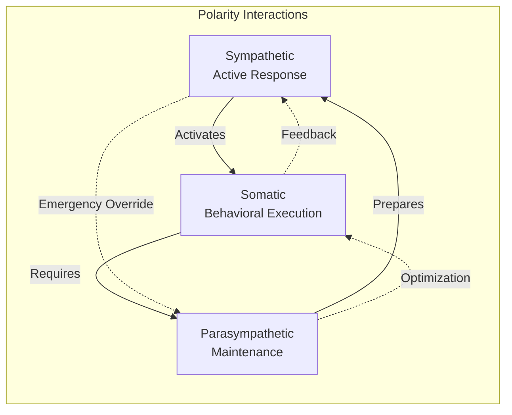

# Polarity Structure and Ennead Framework

This document details the polarity-based architecture underlying the Cognitive Cities system, explaining the neurological mapping of the three primary polarities across the ennead structure and why there are 16 functions instead of the theoretical 18.

## Overview

The Cognitive Cities architecture implements a neurological ennead (nine-fold) structure based on three primary polarities that govern cognitive and behavioral processes. Each polarity represents a fundamental mode of neural operation, and their interaction across three triads creates the complete cognitive system.

## The Three Primary Polarities

### 1. Sympathetic Polarity
**Function**: Active responses, alertness, immediate reactions  
**Characteristics**: 
- Emotive technique commitment
- High-energy, action-oriented processing
- Real-time response generation
- Emergency and high-priority handling

**Neurological Basis**: Sympathetic nervous system activation - fight/flight responses, active engagement

### 2. Parasympathetic Polarity  
**Function**: Rest, maintenance, optimization, background processing  
**Characteristics**:
- Intuitive feeling potential
- Low-energy, maintenance-oriented processing
- Background optimization and homeostasis
- Recovery and system balance

**Neurological Basis**: Parasympathetic nervous system activation - rest/digest, maintenance, healing

### 3. Somatic Polarity
**Function**: Behavioral technique execution, motor control, skill implementation  
**Characteristics**:
- Behavior technique commitment  
- Performance-oriented processing
- Voluntary motor functions
- Learned skill execution

**Neurological Basis**: Somatic nervous system - voluntary muscle control, conscious movement

## Ennead Structure Across Triads

### Theoretical Structure (18 Functions)
In a pure ennead model, each triad would contain all three polarities with dual functions:

```
Triad × Polarity Matrix (Theoretical):
                Sympathetic  Parasympathetic  Somatic    Total
Cerebral        2 functions  2 functions      2 functions = 6
Somatic         2 functions  2 functions      2 functions = 6  
Autonomic       2 functions  2 functions      2 functions = 6
                ──────────────────────────────────────────────
Total:          6 functions  6 functions      6 functions = 18
```

### Actual Implementation (16 Functions)
The neurological reality creates a shared parasympathetic system:

```
Triad × Polarity Matrix (Actual):
                Sympathetic  Parasympathetic  Somatic    Total
Cerebral        1 function   1 function       2 functions = 4
Somatic         1 function   [SHARED]         2 functions = 3*
Autonomic       1 function   [SHARED]         1 function  = 2*
                ──────────────────────────────────────────────
Total:          3 functions  3 functions**    5 functions = 11*
                                              Shared Para: +5
                                              Grand Total: 16
```

*Note: Somatic shows 4 services, Autonomic shows 5 services due to shared parasympathetic functions*  
**Parasympathetic functions are shared between Somatic and Autonomic triads*

## Function-to-Polarity Mapping

### Cerebral Triad (Neocortex)
| Service | Code | Polarity | Function | Implementation |
|---------|------|----------|----------|----------------|
| **Thought Service** | T-7 | Sympathetic | Active idea generation, creative responses | Right hemisphere intuitive processing |
| **Processing Director** | PD-2 | Parasympathetic | Background coordination, resource management | Central executive control |
| **Processing Service** | P-5 | Somatic | Analytical processing, logical analysis | Conscious analytical thinking |
| **Output Service** | O-4 | Somatic | Structured output delivery, commitment to results | Left hemisphere applied techniques |

### Somatic Triad (Basal System)
| Service | Code | Polarity | Function | Implementation |
|---------|------|----------|----------|----------------|
| **Motor Control Service** | M-1 | Sympathetic | Active motor responses, immediate actions | Voluntary motor initiation |
| **Sensory Service** | S-8 | Somatic | Environmental input processing, sensory analysis | Sensory data collection and processing |
| **Processing Service** | P-5 | Somatic | Behavioral technique implementation | Motor skill execution |
| **Output Service** | O-4 | Sympathetic | Behavioral response delivery | Action execution and coordination |

### Autonomic Triad (Limbic System)
| Service | Code | Polarity | Function | Implementation |
|---------|------|----------|----------|----------------|
| **Monitoring Service** | M-1 | Parasympathetic* | System health monitoring, vital signs | Background health monitoring |
| **State Management Service** | S-8 | Parasympathetic* | System state maintenance, memory | Emotional and system state management |
| **Process Director** | PD-2 | Parasympathetic* | Background process orchestration | Automatic process management |
| **Processing Service** | P-5 | Somatic | Emotive processing, intuitive responses | Emotional and subconscious processing |
| **Trigger Service** | T-7 | Sympathetic | Automatic trigger responses, reflexes | Emergency and reflex responses |

*Shared parasympathetic functions that operate across both Somatic and Autonomic systems*

## Shared Parasympathetic Functions

The key insight explaining the 16 vs 18 function count is that **parasympathetic functions naturally span both somatic and autonomic systems** in neurological architecture:

### Biological Justification
1. **Homeostasis**: Maintenance functions affect both voluntary (somatic) and involuntary (autonomic) systems
2. **Recovery**: Rest and repair processes integrate somatic muscle recovery with autonomic organ function
3. **Background Processing**: Optimization occurs across both motor skills and autonomic regulation

### Shared Services
The following services implement parasympathetic functions that serve both triads:

#### Monitoring Service (M-1) - Autonomic Primary, Somatic Secondary
- **Primary**: Autonomic health monitoring, vital signs, system diagnostics
- **Secondary**: Somatic performance monitoring, motor system health

#### State Management Service (S-8) - Autonomic Primary, Somatic Secondary  
- **Primary**: Emotional state, autonomic system state, memory management
- **Secondary**: Motor skill state, behavioral pattern memory

#### Process Director (PD-2) - Autonomic Primary, Somatic Secondary
- **Primary**: Autonomic background processes, homeostatic regulation
- **Secondary**: Motor skill optimization, behavioral pattern refinement

## Polarity Interaction Patterns

### Cross-Polarity Communication


### Polarity Balance Mechanisms
1. **Sympathetic-Parasympathetic Balance**: Classic autonomic balance between action and rest
2. **Somatic-Sympathetic Coordination**: Motor actions triggered by sympathetic activation  
3. **Parasympathetic-Somatic Integration**: Skill optimization during rest periods

## Implementation Guidelines

### Service Design Principles
1. **Polarity Awareness**: Each service should understand its primary polarity and interactions
2. **Cross-Polarity Communication**: Services should support polarity-appropriate communication patterns
3. **Shared Resource Management**: Parasympathetic services must handle dual-triad responsibilities

### API Design Patterns
- **Sympathetic Services**: Real-time, event-driven APIs with immediate responses
- **Parasympathetic Services**: Batch processing, background APIs with queued operations  
- **Somatic Services**: Skill-based APIs with pattern recognition and execution

### Monitoring and Metrics
- **Polarity Balance Metrics**: Track the balance between active, rest, and behavioral processing
- **Cross-Triad Coordination**: Monitor parasympathetic service load across both triads
- **System Harmony**: Ensure polarity interactions maintain overall system stability

## Conclusion

The 16-function architecture reflects the neurobiological reality that parasympathetic (maintenance and rest) functions naturally integrate across both somatic (voluntary) and autonomic (involuntary) systems. This creates a more efficient and biologically accurate implementation than a rigid 18-function model would provide.

The shared parasympathetic functions enable:
- Unified homeostasis across motor and autonomic systems
- Integrated recovery and optimization processes  
- Coordinated background maintenance operations
- Efficient resource utilization through function sharing

This polarity-based architecture provides the foundation for implementing truly cognitive, biologically-inspired distributed systems that mirror human neural organization and processing patterns.