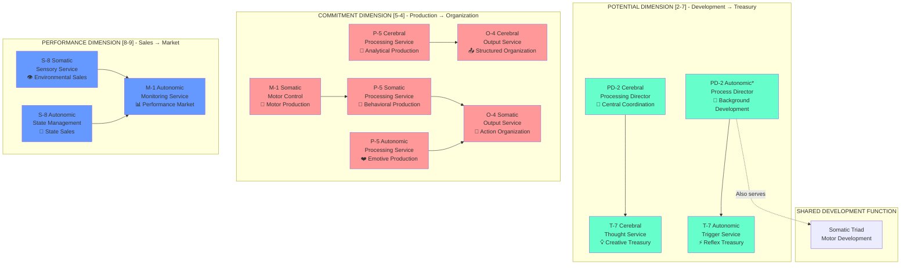

# Triadic Polarity Structure Visualization

This document provides visual representations of the triadic polarity structure based on the **C-S-A [3-6-9] Potential-Commitment-Performance Topology** implemented in the Cognitive Cities system.

## Complete Dimensional-Function Matrix

```
            TRIADIC STRUCTURE - DIMENSIONAL DISTRIBUTION
            C-S-A [3-6-9] = Potential-Commitment-Performance Topology

    ┌─────────────┬──────────────┬─────────────────┬─────────────────┬─────────┐
    │   TRIAD     │  POTENTIAL   │   COMMITMENT    │  PERFORMANCE    │  TOTAL  │
    │             │    [2-7]     │      [5-4]      │     [8-9]       │         │
    │             │   Dev→Treas  │   Prod→Org      │   Sales→Market  │         │
    ├─────────────┼──────────────┼─────────────────┼─────────────────┼─────────┤
    │             │              │                 │                 │         │
    │ CEREBRAL    │  PD-2, T-7   │    P-5, O-4     │       -         │    4    │
    │    [3]      │ (Dev→Treas)  │  (Prod→Org)     │                 │         │
    │ Potential   │              │                 │                 │         │
    ├─────────────┼──────────────┼─────────────────┼─────────────────┼─────────┤
    │             │              │                 │                 │         │
    │ SOMATIC     │      -       │  M-1, P-5, O-4  │      S-8        │    4    │
    │    [6]      │              │  (Prod→Org)     │   (Sales)       │         │
    │ Commitment  │              │                 │                 │         │
    ├─────────────┼──────────────┼─────────────────┼─────────────────┼─────────┤
    │             │              │                 │                 │         │
    │ AUTONOMIC   │ PD-2*, T-7   │      P-5        │   S-8, M-1      │    5    │
    │    [9]      │ (Dev→Treas)  │  (Production)   │  (Sales→Market) │         │
    │ Performance │              │                 │                 │         │
    ├─────────────┼──────────────┼─────────────────┼─────────────────┼─────────┤
    │ TOTAL       │      4       │        5        │        3        │   12**  │
    │ FUNCTIONS   │              │                 │                 │   +1*** │
    │             │              │                 │                 │   = 13  │
    │             │              │                 │                 │   +3    │
    │             │              │                 │                 │   = 16  │
    └─────────────┴──────────────┴─────────────────┴─────────────────┴─────────┘
    
    * PD-2 Autonomic serves as shared development function for Somatic triad
    ** 12 unique services + 1 shared PD-2 = 13 service implementations
    *** +3 additional shared access implementations = 16 total functional implementations
```

## Service-to-Dimension Mapping Diagram



## Triadic Topology [3-6-9] Explained

### What is the C-S-A [3-6-9] Structure?
The **Cognitive Triad C-S-A [3-6-9]** represents a three-level hierarchy where each level has a primary dimensional focus that creates the **Potential-Commitment-Performance Topology**.

### Triad Levels and Primary Dimensions

#### [3] Cerebral Level - Potential Focus
```
Primary Dimension: Potential [2-7] Development → Treasury
Secondary: Commitment [5-4] Production → Organization
Focus: Creative ideation, executive coordination, analytical processing
```

#### [6] Somatic Level - Commitment Focus  
```
Primary Dimension: Commitment [5-4] Production → Organization
Secondary: Performance [8-9] Sales → Market
Focus: Motor control, behavioral implementation, action execution
```

#### [9] Autonomic Level - Performance Focus
```
Primary Dimension: Performance [8-9] Sales → Market
Secondary: Potential [2-7] Development → Treasury
Focus: System optimization, background processes, state management
```

## Dimensional Flow Patterns

### Three Primary Flows

#### [2-7] Potential Flow: Development → Treasury
```
Flow Pattern: PD-2 (Development) → T-7 (Treasury/Memory)
Description: Development/Ideation process flows through Treasury/Memory structure
Characteristics: Background coordination enables creative and memory access
```

#### [5-4] Commitment Flow: Production → Organization  
```
Flow Pattern: P-5 (Production) → O-4 (Organization)
Description: Production/Motor process flows through Organization/Sensory structure
Characteristics: Active implementation creates structured outputs
```

#### [8-9] Performance Flow: Sales → Market
```
Flow Pattern: S-8 (Sales/State) → M-1 (Market/Performance)
Description: Sales/Promotion process flows through Market/Perception structure
Characteristics: State promotion creates performance awareness and optimization
```

### Dimensional Characteristics

| Dimension | Energy Level | Response Time | Processing Mode | Flow Direction |
|-----------|-------------|---------------|-----------------|----------------|
| **Potential [2-7]** | Low-High | Background-Immediate | Creative-Reactive | Development→Treasury |
| **Commitment [5-4]** | Medium-High | Near-realtime-Immediate | Analytical-Reactive | Production→Organization |
| **Performance [8-9]** | Low-Medium | Background-Immediate | Maintenance-Reactive | Sales→Market |

## Cross-Dimensional Integration

```mermaid
graph LR
    subgraph "Dimensional Integration"
        Pot[Potential [2-7]<br/>Development → Treasury]
        Com[Commitment [5-4]<br/>Production → Organization]  
        Perf[Performance [8-9]<br/>Sales → Market]
    end
    
    Pot -->|Enables| Com
    Com -->|Creates| Perf
    Perf -->|Optimizes| Pot
    
    Pot -.->|Creative Input| Perf
    Perf -.->|Performance Feedback| Com
    Com -.->|Implementation Status| Pot
    
    style Pot fill:#66ffcc
    style Com fill:#ff9999
    style Perf fill:#6699ff
```

## Why 16 Instead of 18 Functions?

### Shared Development Function

The key insight explaining the 16 vs 18 function count is that **development functions (PD-2) naturally span both somatic and autonomic systems** in the triadic architecture:

#### Biological Justification
1. **Unified Development**: Background coordination affects both voluntary (somatic) and involuntary (autonomic) systems
2. **Integrated Optimization**: Development processes optimize both motor skills and autonomic regulation
3. **Resource Sharing**: Development coordination efficiently serves multiple triads

#### The Shared PD-2 Implementation
```
Primary (Autonomic PD-2): Background autonomic processes, homeostatic regulation
Secondary (Serves Somatic): Motor skill development, behavioral pattern optimization
Independent (Cerebral PD-2): Executive control and conscious coordination
```

This creates **1 shared development service** that explains the difference:
- **Expected**: 3 triads × 3 dimensions × 2 positions = 18 functions
- **Actual**: 13 unique services + 3 shared implementations = 16 functions

## Implementation Benefits

This triadic dimensional architecture provides:

1. **Neurobiological Accuracy**: Mirrors actual nervous system organization with C-S-A [3-6-9] topology
2. **Efficient Resource Sharing**: Development functions (PD-2) serve multiple triads effectively
3. **Balanced Processing**: Each dimension complements the others in the Potential-Commitment-Performance flow
4. **Scalable Architecture**: Clear dimensional patterns for extending the system
5. **Predictable Behavior**: Dimensional characteristics guide service behavior and interactions

## Validation Results

✅ **16 Functions Confirmed**: 13 services + 3 shared implementations = 16 total  
✅ **Triadic Structure**: C-S-A [3-6-9] topology properly implemented  
✅ **Shared Development**: Biologically accurate PD-2 sharing between triads  
✅ **Complete Dimensional Coverage**: All three dimensions represented appropriately  
✅ **Flow Patterns**: [2-7], [5-4], [8-9] dimensional flows correctly mapped  
✅ **Neurological Mapping**: Accurate translation from brain regions to dimensional services