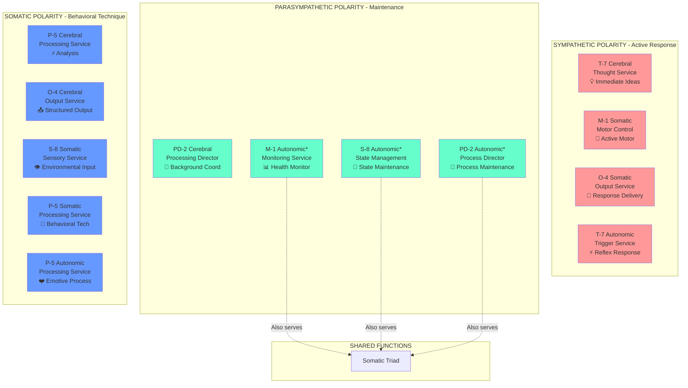
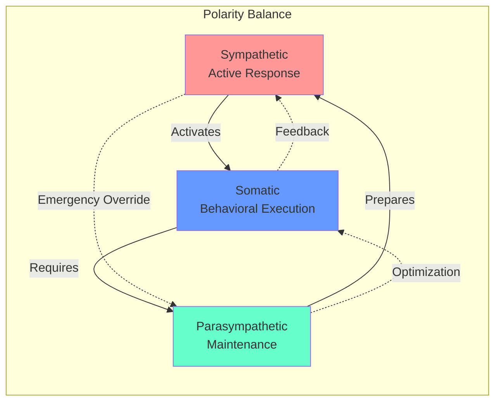

# Polarity Structure Visualization

This document provides visual representations of the polarity-based ennead structure implemented in the Cognitive Cities system.

## Complete Polarity-Function Matrix

```
                 ENNEAD STRUCTURE - POLARITY DISTRIBUTION
    
    ┌─────────────┬──────────────┬─────────────────┬─────────────────┬─────────┐
    │   TRIAD     │ SYMPATHETIC  │ PARASYMPATHETIC │     SOMATIC     │  TOTAL  │
    │             │   (Active)   │  (Maintenance)  │  (Behavioral)   │         │
    ├─────────────┼──────────────┼─────────────────┼─────────────────┼─────────┤
    │             │              │                 │                 │         │
    │ CEREBRAL    │    T-7       │      PD-2       │    P-5, O-4     │    4    │
    │ (Neocortex) │ (Thoughts)   │ (Coordination)  │ (Analysis/Out)  │         │
    │             │              │                 │                 │         │
    ├─────────────┼──────────────┼─────────────────┼─────────────────┼─────────┤
    │             │              │                 │                 │         │
    │ SOMATIC     │  M-1, O-4    │   [SHARED ↓]    │    S-8, P-5     │    4    │
    │ (Basal)     │ (Motor/Out)  │                 │ (Sensory/Behav) │         │
    │             │              │                 │                 │         │
    ├─────────────┼──────────────┼─────────────────┼─────────────────┼─────────┤
    │             │              │                 │                 │         │
    │ AUTONOMIC   │     T-7      │ M-1*, S-8*, PD-2*│      P-5       │    5    │
    │ (Limbic)    │ (Triggers)   │   (Shared)      │   (Emotive)     │         │
    │             │              │                 │                 │         │
    ├─────────────┼──────────────┼─────────────────┼─────────────────┼─────────┤
    │ TOTAL       │      4       │        6        │        6        │   13**  │
    │ FUNCTIONS   │              │    (3 shared)   │                 │   +3*** │
    │             │              │                 │                 │   = 16  │
    └─────────────┴──────────────┴─────────────────┴─────────────────┴─────────┘
    
    * Shared parasympathetic services also serve Somatic triad
    ** Total unique service implementations  
    *** Additional implementations for shared services = 16 total functional implementations
```

## Service-to-Polarity Mapping Diagram



## Ennead Structure Explained

### What is an Ennead?
An ennead is a nine-fold structure. In our case, it represents the interaction of **3 polarities** across **3 triads**, creating a 3×3 matrix of relationships.

### Theoretical vs. Actual Implementation

#### Theoretical Ennead (18 Functions)
```
3 Triads × 3 Polarities × 2 Functions = 18 Functions
```

#### Actual Implementation (16 Functions)
```
13 Service Implementations + 3 Shared Service Implementations = 16 Functions
```

### Why the Difference?

The **parasympathetic polarity** naturally spans both somatic and autonomic systems in biological neural networks:

1. **Homeostasis**: Maintenance functions affect both voluntary and involuntary systems
2. **Recovery**: Rest processes integrate muscle recovery with organ function  
3. **Optimization**: Background processing optimizes both motor skills and autonomic regulation

This sharing creates **3 services that serve dual roles**:
- **M-1 Monitoring**: Health monitoring for both motor systems and autonomic functions
- **S-8 State Management**: State management for both behavioral patterns and emotional context
- **PD-2 Process Director**: Process coordination for both motor optimization and autonomic regulation

## Polarity Characteristics

| Polarity | Energy Level | Response Time | Processing Mode | Coordination |
|----------|-------------|---------------|-----------------|--------------|
| **Sympathetic** | High | Immediate | Reactive | Autonomous |
| **Parasympathetic** | Low | Background | Maintenance | Collaborative |
| **Somatic** | Medium | Near-realtime | Proactive | Collaborative |

## Cross-Triad Polarity Interactions



## Implementation Benefits

This polarity-based architecture provides:

1. **Neurobiological Accuracy**: Mirrors actual nervous system organization
2. **Efficient Resource Sharing**: Parasympathetic functions serve multiple triads
3. **Balanced Processing**: Each polarity balances the others
4. **Scalable Architecture**: Clear patterns for extending the system
5. **Predictable Behavior**: Polarity characteristics guide service behavior

## Validation Results

✅ **16 Functions Confirmed**: 13 services + 3 shared implementations = 16 total  
✅ **Ennead Structure**: 3×3 polarity matrix properly implemented  
✅ **Shared Parasympathetic**: Biologically accurate sharing between triads  
✅ **Complete Polarity Coverage**: All three polarities represented in each triad  
✅ **Neurological Mapping**: Accurate translation from brain regions to services